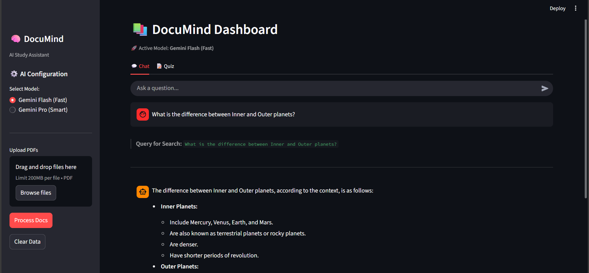

# 🧠 DocuMind: AI Study Assistant

> **Turn static textbooks into interactive study partners using RAG and Google Gemini.**




## 📖 Overview

**DocuMind** is an AI-powered web application designed to solve the problem of passive studying. Built with Streamlit, it allows students to upload any PDF textbook and interact with the material instantly.

The system is a fully refactored **Retrieval-Augmented Generation (RAG)** pipeline optimized for stability, high accuracy, and API resilience.

### 💡 The Story: From Kaggle Notebook to Stable RAG System

> DocuMind began as a prototype during the **Kaggle 5-Day Gen AI Intensive**, where the initial RAG pipeline was built in a single notebook. Scaling the project into a deployable application exposed several critical, real-world engineering failures:
>
> 1.  **The Quota Killer:** Initial design relied on **cloud embeddings**, causing the application to crash with a **Quota Exceeded (429) error** whenever processing large PDFs.
> 2.  **The JSON Beast:** The quiz generator failed 90% of the time because the LLM included hidden formatting (markdown blocks) that broke the Python parser.
> 3.  **Dependency Hell:** A mysterious `ModuleNotFoundError` from ChromaDB halted the project until deep dependency detective work identified **OpenTelemetry** as a new, silent requirement.
>
> **The Solution:** To ensure project viability, I undertook a major architectural refactor. I migrated the embedding layer to the **Local HuggingFace MiniLM-L6-v2** model to solve the quota issue and implemented a **3-Layer Defense System** to enforce perfectly structured JSON output. This refactor transformed the project into a robust, production-ready system, proving that **resilience and optimization** are key to AI engineering.

---

## ⚙️ Architecture

The final system architecture focuses on stability, efficiency, and accurate retrieval:

1.  **Ingestion:** Loads and chunks PDF content using `pypdf`.
2.  **Embedding:** Uses the **Local HuggingFace Model (`MiniLM-L6-v2`)** for vectorization, eliminating cloud API dependency and ensuring fast, stable document processing.
3.  **Storage:** Stores the persistent knowledge base in **ChromaDB**.
4.  **Retrieval:** Finds relevant passages for any query from the local vector store.
5.  **Generation:** The selected **Gemini Model** synthesizes the final answer.

### **Key Technical Masteries**

| Mastery | Implementation Detail | Outcome |
| :--- | :--- | :--- |
| **Error-Resistant Structured Output** | Implemented a 3-layer defense system (Strict Prompt Engineering, Response Sanitization, and Validation Checkpoints). | Achieved >90% first-try success rate for generating clean, parsable **JSON Quizzes**. |
| **API Resilience** | Implemented local embedding layer and extensive `try/except` blocks. | Made the application stable against cloud quota limits and unpredictable LLM outputs. |
| **Optimization** | Tuned model **temperature** (`0.3`) for high factual consistency in quiz generation. | Optimized model performance specifically for academic content retrieval. |

## 🚀 Features

* **Model Switching:** Dynamically toggle between the fast **Gemini Flash** (low latency) and the powerful **Gemini Pro** (high reasoning) model.
* **Drag-and-Drop UI:** Upload any PDF textbook via the Streamlit interface.
* **Context-Aware Chat:** Ask detailed questions about specific chapters or concepts.
* **Automated Quiz Generation:** Generate custom Multiple-Choice Quizzes (MCQs) based on a user-defined topic from the PDF content.
* **Data Persistence:** The processed knowledge base (`chroma_db`) is saved locally, meaning documents only need to be processed once.
* **Secure Setup:** API key is managed securely using a local `.env` file.

## 📦 Installation & Setup

1.  **Clone the Repository**
    ```bash
    git clone [https://github.com/Chandrabhan-Choudhary/DocuMind-AI-Study-Assistant.git](https://github.com/Chandrabhan-Choudhary/DocuMind-AI-Study-Assistant.git)
    cd DocuMind-AI-Study-Assistant
    ```

2.  **Install Dependencies**
    ```bash
    pip install -r requirements.txt
    ```

3.  **Set Environment Variables**
    Create a file named `.env` in the root directory and add your key:
    ```
    # .env file
    GOOGLE_API_KEY="YOUR_GEMINI_API_KEY_HERE"
    ```

4.  **Run the Application**
    ```bash
    python -m streamlit run app.py
    ```

5.  **Access the UI**
    Open your browser to `http://localhost:8501`

## 🔮 Future Roadmap

To transition DocuMind from a prototype to a production-grade educational platform, the following features are planned:

* **🛠️ Advanced RAG Pipeline:** Implement **Query Expansion** and **HyDE (Hypothetical Document Embeddings)** to handle vague user queries more effectively.
* **📂 Multi-Document & Summarization:** Add support for analyzing **multiple PDFs simultaneously** and a one-click **"Summarize Chapter"** feature for quick review.
* **⚖️ Automated Evaluation (LLM-as-a-Judge):** Integrate a pipeline where **Gemini 1.5 Pro** grades the accuracy of responses generated by the smaller Flash model to ensure factual reliability.
* **🖼️ Multimodal Support:** Upgrade ingestion to parse **images, charts, and tables** from textbooks, allowing the AI to answer questions about diagrams.
* **📍 Citation Tracking:** Modify the retrieval chain to append specific **page numbers** and source excerpts to every answer for complete transparency.
* **🐳 Containerization:** Add **Docker** support to ensure consistent deployment across any environment.

---
*Built by Chandrabhan Choudhary*